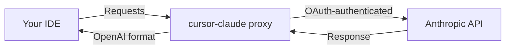

# cursor-claude

> Use your Claude Pro/Max subscription from Cursor (or any OpenAI-compatible IDE) via a small local proxy.

`cursor-claude` is a CLI that runs a local OpenAI-compatible proxy in front of Anthropic's API, authenticated with your own Claude subscription via OAuth. Point your IDE at the proxy and you're done.

## Why

- **Use Claude's latest models in your IDE** without paying for API usage on top of your subscription.
- **No per-token costs** — you're already paying for Claude Max.
- **Full context, streaming, tool use** — the proxy preserves Anthropic's semantics while speaking OpenAI's wire format.

## Quick start

```bash
# 1. Authenticate once
npx cursor-claude login

# 2. Start the proxy
#    For Cursor (needs a public HTTPS URL):
npx cursor-claude start --tunnel
#
#    For any other OpenAI-compatible client on the same machine:
npx cursor-claude start
```

The banner prints your OpenAI Base URL and API key — copy/paste them into your IDE and you're done.

## Important: Cursor requires a public HTTPS URL

Cursor's agent/chat features run inference through Cursor's backend, which then calls your override URL. That means `http://localhost:...` **will not work** for Cursor — the calls originate from Cursor's infrastructure, not your machine.

Three ways around this:

1. **`--tunnel`** (easiest). `cursor-claude start --tunnel` boots the proxy and starts an ngrok HTTPS tunnel to it. Requires the [ngrok CLI](https://ngrok.com/download) (`brew install ngrok/ngrok/ngrok`) and an authtoken (`ngrok config add-authtoken <token>` — free tier works).
2. **Bring your own tunnel**. If you already have ngrok, Cloudflare Tunnel, Tailscale Funnel, etc. running on some port, just:
   - Run `cursor-claude start --port <that-port>` (no `--tunnel` flag).
   - Configure Cursor with `<your-tunnel-url>/v1` and the API key the CLI printed.

   This is the right path on ngrok's free plan, which only allows one active tunnel per account — trying to start a second one will fail. The CLI detects a running ngrok agent and tells you which public URL to reuse.
3. **Deploy remotely** via the Vercel + Upstash path. See **[DEPLOYMENT.md](DEPLOYMENT.md)**.

Other OpenAI-compatible clients that run on the same machine (aider, Continue, Zed, curl, scripts) talk to the proxy directly and don't need a tunnel.

## Install

Run on demand with `npx cursor-claude <command>`, or install globally:

```bash
npm install -g cursor-claude
```

Requires Node.js 18+.

## Commands

```
cursor-claude login              Authenticate with Claude via OAuth.
  --force                        Re-authenticate even if a valid token exists.
  --no-open                      Don't try to auto-open the browser.

cursor-claude start              Start the local proxy.
  -p, --port <port>              Port to listen on (default 9095).
  --no-auto-port                 Fail instead of auto-incrementing a busy port.
  -d, --detach                   Run in the background. Logs to ~/.config/cursor-claude/server.log.
  -t, --tunnel                   Expose the proxy via an ngrok HTTPS tunnel (required for Cursor).
  -k, --api-key <key>            API key clients must send; persisted for future starts.
                                 If omitted, an existing key is reused, or a new one is generated.

cursor-claude models             List Claude model IDs available through your subscription.
  --json                         Output the OpenAI-shaped models payload as JSON.
  --ids-only                     Output one model id per line; ideal for shell pipes.

cursor-claude status             Show auth state, API key, and running server info.
cursor-claude logout             Remove stored OAuth credentials.
cursor-claude --version
cursor-claude --help
```

## Available models

To see the Claude models you can use, run:

```bash
cursor-claude models
```

This prints a table of every Claude model exposed by Anthropic (sourced from [models.dev](https://models.dev)), with the model ID, display name, and release date. Copy any ID into Cursor under **Settings → Models → Add model**.

For scripting:

```bash
cursor-claude models --ids-only           # one id per line
cursor-claude models --json | jq '.data[].id'
```

The same data is served at `GET /v1/models` on the running proxy, so any OpenAI-compatible client that requests `/v1/models` (Cursor included) can discover them automatically too.

### Cursor blocks `claude-*` names — use suffixes instead

Cursor 4.6+ recognises `claude-*` model ids natively and refuses to add them via **Settings → Models → Add model** when a custom base URL is set. The workaround is to add a suffix that Cursor passes through verbatim:

| What you register in Cursor | What the proxy forwards to Anthropic |
|---|---|
| `claude-sonnet-4-6-thinking-xhigh` | `claude-sonnet-4-6` with adaptive thinking + effort `xhigh` |
| `claude-sonnet-4-6-thinking` | `claude-sonnet-4-6` with adaptive thinking |
| `claude-sonnet-4-6-medium` | `claude-sonnet-4-6` with effort `medium` |
| `claude-sonnet-4-5-thinking` | `claude-sonnet-4-5` with enabled thinking, `budget_tokens: 16000` |

Supported effort levels: `low`, `medium`, `high`, `xhigh`, `max`.

The proxy strips the suffix automatically, sets the matching Anthropic API parameters (`thinking`, `output_config.effort`), and forwards the canonical model id — no changes required on your end beyond picking the right name in Cursor.

## API key behavior

The proxy always requires clients to send an API key. The CLI manages this for you:

- **First run**: a random key (`cck_…`) is generated and saved to `~/.config/cursor-claude/config.json`. The banner prints it.
- **Subsequent runs**: the saved key is reused automatically.
- **`--api-key <value>`**: override and persist a new key.
- **`API_KEY` env var**: if set, it takes precedence and is not persisted (useful for CI or shared deployments).
- **`cursor-claude status`** shows the current key any time.

## Optional environment variables

All optional. Set them in the shell, an `.env` file in your cwd, or both.

- `PORT` — default listening port (overridden by `--port`).
- `API_KEY` — if set, overrides the persisted key for this run.
- `ANTHROPIC_OAUTH_CLIENT_ID` — override the OAuth client id (defaults to the official Claude CLI id).
- `REDIS_URL` — if set, credentials are stored in Redis instead of a local file. Useful for remote/shared deployments.
- `UPSTASH_REDIS_REST_URL` / `UPSTASH_REDIS_REST_TOKEN` — Upstash REST alternative to `REDIS_URL`.
- `XDG_CONFIG_HOME` — if set, config and credentials live under `$XDG_CONFIG_HOME/cursor-claude/` instead of the default OS config path.

`dotenv` loads a `.env` from your **current working directory** only (not from your home folder). A stray `REDIS_URL` there switches the credential store for every command run in that directory — see [docs/TROUBLESHOOTING.md](docs/TROUBLESHOOTING.md).

Copy [env.example](env.example) to `.env` and adjust as needed.

## Remote/shared deployment (Vercel + Upstash)

For a stable public URL without running your own tunnel, the project supports a one-click Vercel deploy with an automatically provisioned Upstash Redis database. See **[DEPLOYMENT.md](DEPLOYMENT.md)**.



## Architecture

The codebase uses a small hexagonal layout: pure **domain** logic, **port** interfaces, **adapter** implementations, a thin **HTTP** layer (Hono), and the **CLI**. Details: [docs/ARCHITECTURE.md](docs/ARCHITECTURE.md).

## How it works

1. `login` runs the Anthropic OAuth PKCE flow in the browser and exchanges the returned code for access + refresh tokens.
2. Tokens are persisted locally (file by default) and refreshed automatically on expiry.
3. `start` brings up a Hono HTTP server that exposes `/v1/models`, `/v1/chat/completions`, and `/v1/messages`.
4. Incoming OpenAI-style requests are rewritten to Anthropic's Messages API; responses are streamed back in whichever format the caller asked for.
5. With `--tunnel`, an ngrok subprocess exposes the local port as an HTTPS URL for Cursor to reach.

## Security

- OAuth credentials and the persisted API key live in `~/.config/cursor-claude/` with mode `0600`.
- The proxy binds to `localhost` by default. `--tunnel` exposes it on the public internet for the duration of the command; the required API key protects it.
- No telemetry. Source is MIT-licensed.

## FAQ

- **Cursor and localhost** — Cursor’s servers must reach your base URL over HTTPS; use `--tunnel` or your own public URL. See [Important: Cursor requires a public HTTPS URL](#important-cursor-requires-a-public-https-url) above.
- **Port already in use** — Another process holds the port, or a previous detached server is still running. Try `cursor-claude status`, pick another `--port`, or allow auto-port (omit `--no-auto-port`). More: [docs/TROUBLESHOOTING.md](docs/TROUBLESHOOTING.md).
- **Wrong credential store (Redis vs file)** — Check for `REDIS_URL` in your shell or a `.env` in the directory you run from. [docs/TROUBLESHOOTING.md](docs/TROUBLESHOOTING.md#unexpected-redis--remote-credential-store)
- **Publishing** — Maintainer checklist: [docs/PUBLISHING.md](docs/PUBLISHING.md). Release notes: [CHANGELOG.md](CHANGELOG.md).

## Contributing

See [CONTRIBUTING.md](CONTRIBUTING.md) for setup, scripts, and PR expectations. Issues and PRs are welcome.

## Credits

Based on the earlier [Maol-1997/cursor-claude-connector](https://github.com/Maol-1997/cursor-claude-connector) project. Huge thanks to the original author for the core OAuth flow and Anthropic-to-OpenAI translation that this CLI builds on. `cursor-claude` is a separate codebase (not a GitHub fork) — significantly restructured around a CLI, hexagonal architecture, persistent API keys, an ngrok tunnel, and a full test suite — but the foundational ideas come from there.

## License

MIT. Not affiliated with Anthropic, Cursor, or ngrok.
